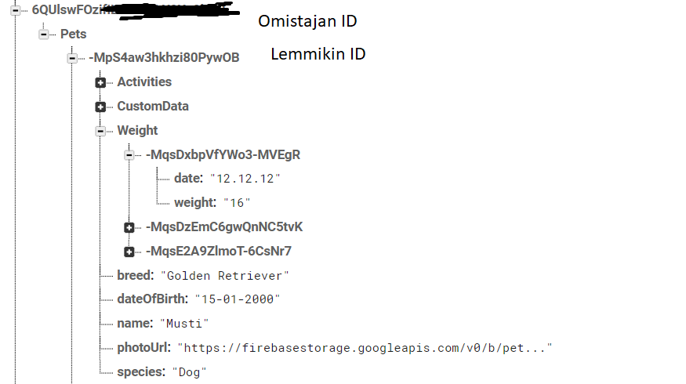

# Pet health tracker app 
Mobile application development project.

Project done in group of four.

Aim of project was to make easy to use app to help pet owners. App supports multiple pets and all pet info is stored in Firebase. 


### INFO
```
Android studio
Java
Firebase Authentication, Realtime Database, Storage
```


*Sign in with email address*


*Add pet and pet info page*


*Custom tables allow to store any data*




*Firebase data*


## Contributors

Alamaar: Desing, Firebase desing and firebase actions, sig-in and authentication, custompage, pictures, mainpage, petpage

t9satu01:  Desing, petpage, weightpage

t9koal02:  Design, mainpage, feedingpage

Aino-SiskoAuvinen: Desing, Finnish-English translation


### How to deploy
Create new project to Firebase. Add Realtime Database and Storage. Copy google-services.json to app folder and launch the app.
